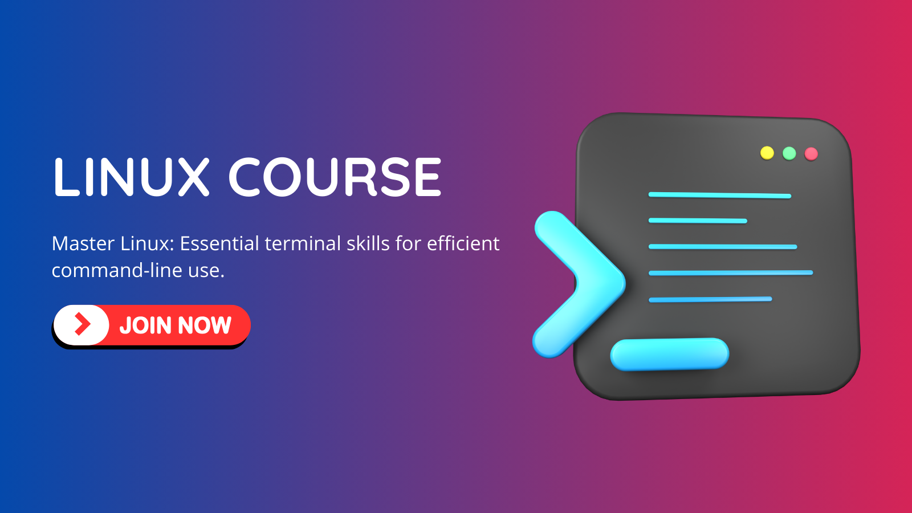

[](https://www.pytopia.ai)
[](https://t.me/pytopia_ai)
[](https://instagram.com/pytopia.ai)
[](https://www.youtube.com/@pytopia)
[](https://linkedin.com/company/pytopia)
[](https://twitter.com/pytopia_ai)

Welcome to the Linux Terminal Mastery course repository! This comprehensive course is designed to provide you with a deep understanding of Linux, focusing primarily on its powerful terminal. Whether you're a beginner looking to get started with Linux or an experienced user aiming to enhance your command-line skills, this course will equip you with the knowledge and practical experience needed to become proficient in Linux terminal usage.

# 🎯 Course Objectives

By the end of this course, you will:

- Understand the fundamental principles and concepts of Linux
- Master essential terminal commands and operations
- Learn advanced text processing and system management techniques
- Gain hands-on experience in shell scripting and task automation
- Acquire skills in networking, security, and troubleshooting via the terminal
- Apply your knowledge to real-world Linux administration scenarios
- Prepare yourself for advanced topics in Linux system administration and DevOps

# 📚 Course Contents

The course is divided into the following chapters:

1. Introduction to Linux and the Terminal
2. Essential Terminal Commands
3. Working with Text
4. System Information and Management
5. Package Management
6. Networking in the Terminal
7. Shell Scripting Basics
8. Process Management
9. Environment Variables and Shell Configuration
10. Advanced Terminal Tools
11. Automating Tasks


Each chapter includes a combination of theoretical explanations, practical examples, and hands-on exercises to reinforce your understanding of the concepts and their applications in real-world scenarios. The course culminates with a series of practical Linux projects that allow you to apply your newly acquired skills to solve real-world problems, giving you valuable experience and a portfolio of projects to showcase.

# ✅ Prerequisites

To get the most out of this course, you should have:

- Basic computer literacy
- Familiarity with basic computer operations
- Access to a Linux environment (can be a virtual machine or WSL for Windows users)
- Enthusiasm to learn and explore the powerful world of Linux!

# 📚 Learn with Us!
We also offer a [course on these contents](https://www.yourwebsite.com/courses/linux-terminal) where learners can interact with peers and instructors, ask questions, and participate in online coding sessions. By registering for the course, you also gain access to our dedicated Telegram group. Enroll now and start learning! Here are some useful links:

- [Linux Terminal Course](https://www.yourwebsite.com/courses/linux-terminal)
- [Public Telegram Group](https://t.me/your_telegram_group)
- [Our Website](https://www.yourwebsite.com/)

[](https://www.yourwebsite.com/courses/linux-terminal)

# 🚀 Getting Started

To get started with the course, follow these steps:

1. Clone this repository to your local machine using the following command:
   ```
   git clone https://github.com/pytopia/linux-terminal.git
   ```

2. Navigate to the cloned repository:
   ```
   cd linux-terminal
   ```

3. Ensure you have access to a Linux environment (local installation, virtual machine, or WSL).

4. Start exploring the course materials, beginning with the first chapter.

Throughout the course, you will gain a deep understanding of Linux and its terminal capabilities. By completing the practical projects, you will develop the skills and confidence to tackle real-world Linux administration challenges. This course sets the stage for your journey into more advanced topics in Linux system administration and DevOps.

# 📞 Contact Information

Feel free to reach out to us!

- 🌐 Website: [pytopia.ia](https://www.pytopia.ai)
- 💬 Telegram: [pytopia_ai](https://t.me/pytopia_ai)
- 🎥 YouTube: [pytopia](https://www.youtube.com/@pytopia)
- 📸 Instagram: [pytopia.ai](https://www.instagram.com/pytopia.ai)
- 🎓 LinkedIn: [pytopia](https://www.linkedin.com/in/pytopia)
- 🐦 Twitter: [pytopia_ai](https://twitter.com/pytopia_ai)
- 📧 Email: [pytopia.ai@gmail.com](mailto:pytopia.ai@gmail.com)
